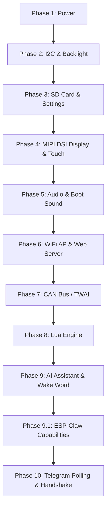

# 🚀 ESP32-P4 ECU Dashboard (Dashboard_P5) - System Initialization Architecture

This document details the strictly sequential **10-phase boot flow** of the `Dashboard_P5` firmware. This sequence is designed to maximize visual responsiveness, ensure peripheral bus stability, and prevent heap memory fragmentation in memory-heavy voice and network tasks.



---

## 📋 Detailed Boot Phases

### 🔌 Phase 1: Power Initialization
* **Actions:** Calls `board_init_power()` followed by a mandatory `100ms` delay to allow the voltages to stabilize.
* **Purpose:** Ensures clean, hardware-level power distribution to the co-processors and peripherals.

### 🎛️ Phase 2: I2C Bus & Backlight Setup
* **Actions:** Installs the master I2C bus driver (`I2C_NUM_0`) with internal pull-ups enabled, and initializes the LCD backlight controller.
* **Hardware Config:** SDA = GPIO 7, SCL = GPIO 8.
* **Purpose:** Prepares the shared communication bus used by the display, touch screen, and audio DAC.

### 💾 Phase 3: SD Card & Settings Manager
* **Actions:** Initializes the high-speed SDIO interface for the SD Card.
  * If the SD Card is detected, it loads and applies persistent GUI and system settings (`settings_load()`).
  * If the SD Card is absent, it falls back to defaults.
  * Launches the asynchronous `background_task_worker` to handle async settings commits to disk.
* **Purpose:** Restores user calibration, theme choices, and volume settings early in the boot.

### 📺 Phase 4: Display & GUI (MIPI DSI)
* **Actions:**
  1. Sets up the high-speed MIPI DSI panel and initializes the ILI9881C display panel driver.
  2. Initializes the GT9271 Touch controller **after** the display is fully powered to prevent address conflicts or hardware bus interference.
  3. Launches the **LVGL Graphics Library** (`main_gui_init()`) to draw the dashboard layout.
* **Purpose:** Ensures the screen lights up and displays the UI as quickly as possible to provide visual feedback.

### 🔊 Phase 5: Audio Driver (ES8311)
* **Actions:** Sets up the I2S audio peripheral and the ES8311 DAC. Sets startup volume, loads the boot WAV file from the SD Card, and plays the startup sound asynchronously.
* **Purpose:** Confirms audio subsystem health and plays the welcome chime.

### 🌐 Phase 6: WiFi Access Point & Web Server
* **Actions:** Initiates host-processor transport to the ESP32-C6 co-processor. Launches the local Access Point (AP) mode and boots the HTTP Web Server on port 80.
* **Delay:** Intentionally delayed by **6 seconds** from audio startup to ensure audio buffers don't get interrupted or stutter due to initial network scan interrupts.
* **Purpose:** Sets up the local configuration dashboard network.

### 🛞 Phase 7: CAN Bus (TWAI) Services
* **Actions:** Installs and starts the Two-Wire Automotive Interface (TWAI) driver (`can_init()`).
* **Purpose:** Connects the dashboard to the ECU network to receive live engine telemetry (RPM, Boost, temperatures).

### 🌙 Phase 8: Lua Scripting Engine
* **Actions:** Spawns the Lua virtual machine manager (`lua_manager_init()`).
* **Purpose:** Prepares the dynamic runtime engine to execute background automation rules and rusEFI-compatible scripts.

### 🤖 Phase 9: AI Assistant & Wake Word Detection
* **Actions:**
  * Configures the Gemini REST API manager.
  * Loads the acoustic speech recognition models (`wakenet9` for **"Jarvis"** wake word) from the flash partition mapping.
  * Spawns the `ai_wake_word` worker task pinned to Core 0 to perform real-time speech processing.
* **Purpose:** Prepares the voice assistant to listen for wake words.

### 🧩 Phase 9.1: ESP-Claw Capabilities
* **Actions:** Registers all 13 LLM-visible capability groups (such as `Telegram`, `Lua`, `Files`, `System`, `Time`, and `Scheduler`) with the ESP-Claw capability manager.
* **Purpose:** Allows the AI agent to dynamically interact with the hardware and software layers.

### 💬 Phase 10: Telegram Polling & Online Handshake
* **Actions:**
  1. Ensures the event router rules folder `/sdcard/SYSTEM/RULES/` exists.
  2. Mounts the router JSON rules file using the standard FATFS 8.3-compatible filename `rt_rules` (replaces obsolete `router.json` to prevent `.tmp` write issues).
  3. Installs a dynamic bridge callback `tg_to_dashboard` to route incoming chat commands straight to the AI agent.
  4. Starts the HTTPS long-polling loop immediately.
  5. Wait for network/time synchronization, then send the secure **"IFF: FRIEND / Diagnostic: STABLE"** Telegram startup notification message.
* **Design Rationale:** Telegram is started concurrently with the audio system (without synthetic delays) to allow MbedTLS to safely allocate large, contiguous TLS context buffers in PSRAM before internal SRAM gets fragmented by dynamic AFE audio heaps.

---

## 🔒 Memory Allocation Optimizations

To prevent connection drops and SSL handshake failures (`mbedtls_ssl_setup returned -0x7F00`), the following critical compiler flags are set in `sdkconfig.defaults`:

```ini
# Forces MbedTLS dynamic allocations (handshakes, context) into PSRAM (16MB)
CONFIG_MBEDTLS_INTERNAL_MEM_ALLOC=n
CONFIG_MBEDTLS_EXTERNAL_MEM_ALLOC=y

# Dynamically allocates and frees network buffers to conserve memory
CONFIG_MBEDTLS_DYNAMIC_BUFFER=y
```
